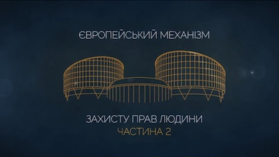

#Необхідність в демократичному суспільстві

  <iframe class="embed-responsive-item" src="https://www.youtube.com/embed/8bUL_TLIvZk?rel=0" allowfullscreen></iframe>

##Список рішень використаних у відео:
* [«Eweida та інші проти Сполученого Королівства» заяви №№ 48420/10, 59842/10, 51671/10 та 36516/10, рішення від 15.01.2013](https://courses.ed-era.com/assets/courseware/3999b647055582b6f6046f392f7dd475/asset-v1:EdEra+HR201+hr201+type@asset+block/8-Eweida.pdf)
* [«Barankevich проти Росії » заява № 10519/03, рішення від 26.07.2007](http://europeancourt.ru/uploads/ECHR_Barankevich_v_Russia_26_07_2007.pdf)
* [«Avilkina та інші проти Росії» заява № 1585/09, рішення від 6.06.2013](http://hudoc.echr.coe.int/eng?i=001-120071)
* [«Тросін проти України» заява № 39758/05, рішення від 23.05.2012](https://courses.ed-era.com/asset-v1:EdEra+HR101+hr101+type@asset+block@1_Trosin_proty_Ukrayiny.pdf)
* [«Котій проти України» заява № 28718/09, рішення від 5.03.2015](https://courses.ed-era.com/asset-v1:EdEra+HR101+hr101+type@asset+block@1_Kotii_vs_Ukraine.pdf)
* [«Сергій Волосюк проти України» заява № 1291/03, рішення від 12.03.2009](https://courses.ed-era.com/assets/courseware/dc986a596375f561741c7696bfc1848a/asset-v1:EdEra+HR201+hr201+type@asset+block/8-Volosyuk.pdf)
* [«Фельдман проти України № 2» заява № 42921/09, рішення від 12.01.2012](https://courses.ed-era.com/assets/courseware/93bd9ea4249ea74245a9515a93d410e7/asset-v1:EdEra+HR201+hr201+type@asset+block/8-Feldman2.pdf)
* [«Савіни проти України» заява № 39948/06, рішення від  18.12.2008](https://courses.ed-era.com/assets/courseware/30b11f335eddd0f58953276f99ca4926/asset-v1:EdEra+HR201+hr201+type@asset+block/8-Saviny.pdf)
* [«Hatton та інші проти Сполученого Королівства» заява № 36022/97, рішення від 8.07.2003](http://docs.pravo.ru/document/view/19382767/)
* [«Хант проти України» заява № 31111/04, рішення від 7.12.2006](./Hunt_v._Ukraine.pdf)

<h3>Безкоштовні онлайн-курси:</h3>

  

    

      

        
        

          <h5><b>Європейський механізм захисту прав людини. Частина 1</b></h5> 
          
Курс знайомить із темою захисту прав людини крізь призму основних положень Конвенції про захист прав людини та основоположних свобод (Конвенції) та практики Європейського суду з прав людини (ЄСПЛ). Для широкого кола слухачів.
 
          <a class="btn btn-primary" href="https://courses.ed-era.com/courses/course-v1:EdEra+HR101+hr101/about" role="button">Реєстрація</a>
        

      

    

    

      

        
        

          <h5><b>Європейський механізм захисту прав людини. Частина 2</b></h5> 
          
Продовження курсу «Європейський механізм захисту прав людини». Для тих, хто прагне поглибити отримані знання й навчитися аналізувати практику Суду відповідно до статей Конвенції.
 
          <a class="btn btn-primary" href="https://courses.ed-era.com/courses/course-v1:EdEra+HR201+hr201/about" role="button">Реєстрація</a>
        

      

    

  

 
