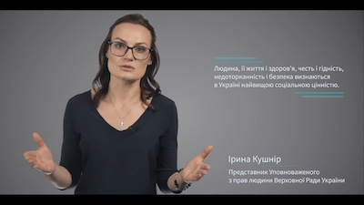
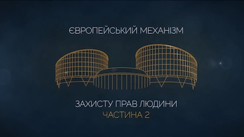

# Умови втручання в право на мирне володіння майном
## Стаття 1 Першого протоколу

  <iframe class="embed-responsive-item" src="https://www.youtube.com/embed/ljiiAQCltzY?rel=0" allowfullscreen></iframe>

### Список рекомендованих рішень:
* [«Seryavin та інші проти України», заява № 4909/04, рішення від 10.02.2010](pdf/Seryavin_v._Ukraine.pdf)
* [«Frizen проти Росії», заява № 58254/00, рішення від 24.03.2005](pdf/Frizen.pdf)
* [«Andriy Rudenko проти України», заява № 35041/05, рішення від 21.12.2010](pdf/Rudenko.pdf)
* [«Serkov проти України»
, заява № 39766/05, рішення 7.07.2011](pdf/Serkov.pdf)
* [«Shchokin проти України», заяви № 23759/03 та № 37943/06, рішення від 14.10.2010](pdf/Shochkin.pdf)
* [«Tiramavia S.R.L. та інші проти Республіки Молдова», заява № 54115/09, 55707/09 і 55770/09, рішення від 4.09.2018](pdf/Tiramavia.pdf)
* [«Gogitidze та інші проти Грузії» заява № 36862/05, рішення від 12.05.2015](https://courses.ed-era.com/assets/courseware/9e466733eab9aeb296f9e4ce7973e27c/asset-v1:EdEra+HR201+hr201+type@asset+block/1P1-Gogitidze.pdf)
* [«Tkachevy проти Росії», заява № 35430/05б від 14.02.2012](pdf/Tkachevy.pdf)
* [«B. Tagliaferro & Sons Limited and Coleiro Brothers Limited проти Мальти», заява № 75225/13 і 77311/13, рішення від 11.09.2018](http://hudoc.echr.coe.int/eng?i=001-186046)
* [«Fedorenko проти України», заява N 25921/02), рішення від 1.06.2006](pdf/Fedorenko.pdf)
* [«Великода
 проти України», заява № 43331/12, рішення від 3.06.2014](pdf/Velykopada.pdf)
* [«Stebnitskiy і Komfort проти України», заява № 10687/02, рішення від 3.02.2011](pdf/Stebnitskiy_Komfort.pdf)
* [«East/West Alliance Limited проти України», заява № 19336/04, рішення від 23.01.2014](pdf/East_West.pdf)
* [«Könyv-Tár Kft та інші проти Угорщини», заява № 21623/13, рішення від 16.10.2018](pdf/Könyv.pdf)
* [«Tre Traktörer Aktiebolag проти Швеції», заява № 10873/84, рішення від 07.07.1989](pdf/Traktorer.pdf)
* [«Юрій Миколайович Іванов
 проти України», заява N 40450/04)
, рішення від 15.10.2009](pdf/Ivanov.pdf)
* [«Van Marle та інші проти Нідерландів», заяви №№ 8543/79; 8674/79; 8675/79; 8685/79, рішення від 26.06.1986](pdf/van_Marle.pdf)

<h3>Безкоштовні онлайн-курси:</h3>

  

    

      

        
        

          <h5><b>Європейський механізм захисту прав людини. Частина 1</b></h5> 
          
Курс знайомить із темою захисту прав людини крізь призму основних положень Конвенції про захист прав людини та основоположних свобод (Конвенції) та практики Європейського суду з прав людини (ЄСПЛ). Для широкого кола слухачів.
 
          <a class="btn btn-primary" href="https://courses.ed-era.com/courses/course-v1:EdEra+HR101+hr101/about" role="button">Реєстрація</a>
        

      

    

    

      

        
        

          <h5><b>Європейський механізм захисту прав людини. Частина 2</b></h5> 
          
Продовження курсу «Європейський механізм захисту прав людини». Для тих, хто прагне поглибити отримані знання й навчитися аналізувати практику Суду відповідно до статей Конвенції.
 
          <a class="btn btn-primary" href="https://courses.ed-era.com/courses/course-v1:EdEra+HR201+hr201/about" role="button">Реєстрація</a>
        

      

    

  

 
