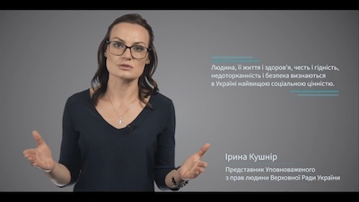

# Інтерактивний журнал «Європейський механізм захисту прав людини»

  <!-- Nav tabs -->
  <ul class="nav nav-tabs" role="tablist">
    <li role="presentation" class="active"><a href="#home" aria-controls="home" role="tab" data-toggle="tab">Випуск №1</a></li>
  </ul>
  <!-- Tab panes -->
  

    
<h3>Випуск №1</h3>
		<ul type="disc">
			<li><a href="./1/main-review.html">Огляд рішень щодо України, які були постановлені з початку року</a></li>
			<li><a href="./1/others-countries.html">Рішення щодо інших держав</a></li>
			<li><a href="./1/zakonnist.html">Відеолекція: «Принцип законності»</a></li>
			<li><a href="./1/pereklady.html">Переклад рішень</a>
				<ul>
					<li><a href="./1/navalnyi.html">«Навальний та Офіцеров проти Росії»</a>
						<ul>
							<li><a href="./1/navalnyi-fakty.html">Факти. Обставини справи</a></li>
							<li><a href="./1/navalnyi-vidpovidne-zakonodavstvo.html">Факти. Відповідне національне законодавство та практика</a></li>
							<li><a href="./1/navalnyi-pravo.html">Право</a></li>
							<li><a href="./1/navalnyi-porushennya.html">Порушення</a></li>
							<li><a href="./1/navalnyi-na-cyh-pidstavah.html">На цих підставах Суд:</a></li>
							<li><a href="./1/navalnyi-okrema-dumka.html">Спільна окрема думка часткової незгоди суддів Ніколау, Келлера та Дєдова</a></li>
						</ul>
					</li>
					<li><a href="./1/zubac.html">«Zubac проти Хорватії»</a>
						<ul>
							<li><a href="./1/zubac-fakty.html">Факти</a></li>
							<li><a href="./1/zubac-vidpovidne-zakonodavstvo.html">Факти. Відповідне національне законодавство та практика</a></li>
							<li><a href="./1/zubac-pravo.html">Право</a></li>
						</ul>
					</li>
					<li><a href="./1/vytyag.html">Переклад витягу з рішення Конституційного Суду Республіки Литва</a></li>
				</ul>
			</li>
		</ul>
	

  

---

> «Виживає не сильніший і не розумніший, а той, хто найкраще реагує на зміни, що відбуваються» **(Гордон&nbsp;Драйден).**
 
З 2014 року Координатор проектів ОБСЄ в Україні, за фінансової підтримки Уряду Канади та експертної підтримки національних фахівців у галузі захисту прав людини, опікується впровадженням комплексної професійної освіти із застосування Конвенції про захист прав людини та основоположних свобод (ЄКПЛ) та практики Європейського суду з прав людини (ЄСПЛ). Розроблено та впроваджено цілу низку освітніх продуктів, зокрема, у форматі **[онлайн-курсів.](#online-courses)** 

Вони стали частиною професійної підготовки та платформою для поглиблення знань близько 10&nbsp;000 фахівців у галузі права – суддів, адвокатів, науковців. Ми прагнемо зробити освітні продукти гнучкими не лише до потреб слухачів, але й до динамічної практики ЄСПЛ, постійної зміни національного правозастосування та законодавства. Тому ми пропонуємо вам унікальний «живий» відео журнал, створений з метою:
* аналізу ключових для України рішень ЄСПЛ;
* постійного професійного діалогу з провідними експертами із застосування ЄКПЛ та практики ЄСПЛ; 
* висвітлення практики національного правозастосування через призму гарантій ЄКПЛ та практики ЄСПЛ;
* здійснення якісного перекладу значущих для національної практики рішень ЄСПЛ та його розповсюдження.

Журнал не надасть готових рецептів для правильних дій. Натомість, він запропонує професійні інструменти і пояснить, як застосовувати їх на практиці в умовах, коли суспільні відносини стрімко змінюються. А разом з ними — і практики здійснення правосуддя.  

Ініціатива впроваджується в межах Проекту Координатора проектів ОБСЄ в Україні «Гарантування дотримання прав людини при здійсненні правосуддя», за участі національних експертів та фінансової підтримки Уряду Канади:

<table>
	<tr style="border: 0px;">
		<td style="width:30%; border: 0px;">
			
		</td>
		<td style="border: 0px;">
			
<b>Ірина Кушнір,</b> експертка проекту «Гарантування дотримання прав людини при здійсненні правосуддя» Координатора проектів ОБСЄ в Україні, співзасновниця громадської організації «Український інститут з прав людини»

	</tr>
	<tr style="border: 0px;">
		<td style="border: 0px;">
			
		</td>
		<td style="border: 0px;">
			
<b>Назар Кульчицький,</b> експерт проекту «Гарантування дотримання прав людини при здійсненні правосуддя» Координатора проектів ОБСЄ в Україні, голова адвокатського об’єднання «Назар Кульчицький і партнери»

	</tr>
</table>

###Організації-розробники

	<table>
	    <tr style="border: 0px">
	      <td class="align-middle" style="border: 0px"></td>
	      <td class="align-middle" style="border: 0px"></td>
	    </tr>
	</table>    		
	

###За підтримки

	<table>
	    <tr style="border: 0px">
	      <td class="align-middle" style="border: 0px"></td>
	    </tr>
	</table>    		

<h3 id="online-courses">Безкоштовні онлайн-курси:</h3>

  

    

      

        
        

          <h5><b>Європейський механізм захисту прав людини. Частина 1</b></h5> 
          
Курс знайомить із темою захисту прав людини крізь призму основних положень Конвенції про захист прав людини та основоположних свобод (Конвенції) та практики Європейського суду з прав людини (ЄСПЛ). Для широкого кола слухачів.
 
          <a class="btn btn-primary" href="https://courses.ed-era.com/courses/course-v1:EdEra+HR101+hr101/about" role="button">Реєстрація</a>
        

      

    

    

      

        
        

          <h5><b>Європейський механізм захисту прав людини. Частина 2</b></h5> 
          
Продовження курсу «Європейський механізм захисту прав людини». Для тих, хто прагне поглибити отримані знання й навчитися аналізувати практику Суду відповідно до статей Конвенції.
 
          <a class="btn btn-primary" href="https://courses.ed-era.com/courses/course-v1:EdEra+HR201+hr201/about" role="button">Реєстрація</a>
        

      

    

  

<h3>Заповніть анкету та слідкуйте за новинами журналу!</h3>
<iframe src="https://docs.google.com/forms/d/e/1FAIpQLSd-NG9Vm4X7aNHEiZaH7rCazcCclnpoJCWWOVgJOBYPY6WXNw/viewform?embedded=true" width="100%" height="420px" frameborder="0" marginheight="0" marginwidth="0">Завантаження...</iframe>

 
